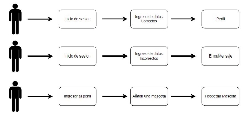

# Análisis y diseño de sistemas 1 
# PROYECTO 2

OBJETIVOS

**General**

Comprender y reconocer los requerimientos de un proyecto, modelarlos y realizar el diseño aplicando buenas prácticas de ingeniería de software

**Específicos**

1. Realizar pruebas end to end (E2E) para validar el flujo correcto de la aplicación e identificar errores.
1. Modelar los requerimientos utilizando casos de uso e historias de usuario.
1. Comprender y aplicar el proceso de Integración continua (CI).
1. Que el estudiante reafirme la importancia del trabajo en equipo.
1. Llevar a cabo una correcta documentación de los procesos realizados para realizar el proyecto.

Huellita Feliz

Para esta ocasión su equipo de trabajo fue contratado para realizar la página web de un hotel para mascotas en donde los dueños pueden ver el estado en el que están sus mascotas aunque no estén con ellos. La plataforma debe de contener las siguientes funciones

Roles

Dentro de la aplicación se tendrán dos roles principales, cada uno de ellos tiene funciones definidas para poder realizar distintas actividades dentro de la plataforma.

**Cuidadores**

Estos usuarios son los encargados de manejar todo lo relacionado con el cuidado de los animales que ingresan a la plataforma, desde el momento en que empiezan a atender a las mascotas, hasta que termine su estadía dentro del hotel, también se encargan de realizar todas las actividades que deben cumplir durante el día

**Usuarios**

Estos son los clientes que desean utilizar el servicio de huellita feliz, ellos deben ingresar el perfil de sus mascotas, pueden indicar cuidados especiales si lo desean y pueden ver en todo momento el estado de sus mascotas, si están paseando, comiendo o tomando una siesta. También cuentan con un área de reseñas en donde pueden visualizar los comentarios de los demás usuarios clientes.

Registro

Para poder hacer uso de todas las funcionalidades de la aplicación, todos los usuarios deberán realizar su proceso de registro, para ello deberán llenar un formulario con los siguientes datos:

- Nombre
- Apellido
- Numero de telefono
- Dirección de correo electrónico (debe existir)
- Contraseña (min 8 caracteres, incluir una Mayúscula y números)
- Fecha de Nacimiento
- Rol(Trabajador o cliente)

Inicio de Sesión

Para ingresar a la plataforma deberá de llegar un código al correo electrónico del usuario el cual debe de colocar como contraseña en la primera vez de ingreso, las siguientes ocasiones deberá de colocar su contraseña. Al momento de ingresar la primera vez deberá mostrar un mensaje de error si entra con la contraseña y no con el código, de igual manera si el código es incorrecto deberá mostrar mensaje de error.

Funcionalidades

Cuidador

**Página principal Cuidador**

Al momento de que un usuario inicie sesión deberá mostrar su perfil con sus datos, aquí el usuario podrá editar cualquiera de los campos que se muestran.

**Selección de mascota**

Cada cuidador podrá encargarse como máximo de dos mascotas, debe de existir una vista en donde se desplieguen todas las mascotas que están hospedados en ese momento y debe de existir una opción para atender.

Nota: Si el cuidador ya tiene 2 mascotas a su deberá mostrar un mensaje de error al querer atender a una tercera mascota o deshabilitar la opción de atender

**Atención de mascota**

Debe de existir una vista en donde el cuidador pueda observar las mascotas que está atendiendo en ese momento visualizando el perfil de la mascota junto con una opcion de actualizar el estado de la mascota

Los estados disponibles son

- Comiendo
- Paseando
- Bañado
- Tomando la siesta
- Jugando

**Devolución de mascota**

Al momento que el cuidador escoja una mascota deberá de mostrar siempre la fecha en la que debe devolverla, por lo que hasta ese día deberá de mostrarse la opción de devolución para que su estado pase a “Listo para recoger” y los dueños puedan pasar por él.

**Reseñas**

Debe de existir un apartado en donde los cuidadores puedan visualizar todos los comentarios que han hecho los dueños de las mascotas con la posibilidad de eliminar cualquier comentario ya sea por lenguaje inapropiado o comentarios groseros.

**Tienda**

Los usuarios que son cuidadores pueden agregar productos que tienen a la venta en el hotel para que los clientes puedan visualizar y en algún momento puedan comprarlos en el hotel físicamente, la creación de productos para la tienda debe de llevar lo siguiente:

- Imagen
- Nombre de producto
- Descripción breve
- Precio de venta
- Cantidad disponible

Debe existir la posibilidad de actualizar el precio de venta y la cantidad disponible, y la opción de poder eliminar el producto.

Cliente

**Página principal Cliente**

Al momento de que un usuario inicie sesión deberá mostrar su perfil con sus datos, aquí el usuario podrá editar cualquiera de los campos que se muestran.

**Creación de perfil**

Ya que cada persona puede tener más de una mascota, debe existir una opción para poder agregar una ficha de información de las mascotas, por lo que para este formulario se le solicita lo siguiente

- Nombre de mascota
- Edad
- Especie (únicamente de manejara gato o perro)
- Raza
- Comportamiento
- Contacto del veterinario
- Comentarios extra

El usuario podrá crear la cantidad de fichas que desee en base a sus necesidades. **Hospedar mascota**

Dentro de la vista donde se listan los perfiles de las mascotas deberá existir una opcion que diga “hospedar mascota” la cual deberá mostrar un formulario en donde se ingrese la fecha en la que desea que le regresen a su mascota.

Queda a discreción del grupo si al momento de de hospedar la mascota deshabilitar esa opción en el perfil, deshabilitan la ficha, o indican en un mensaje que está hospedado

Se debe de mostrar el estado de las mascotas al momento de estar hospedadas para que los dueños puedan saber el estado de sus mascotas.

**Reseñas**

Debe de existir un apartado en donde los clientes puedan calificar la plataforma (de 1 a 5 siendo 5 la mejor calificación) y dejar comentarios al respecto del hotel o del trato que recibieron sus mascotas para que los demás usuarios puedan leerlos, debe de existir la opción de eliminar los propios comentarios del usuario

**Recoger mascota**

Cuando el estado de la mascota sea “Listo para recoger” debe de habilitarse una opción para poder recoger a la mascota, al momento de recogerla deberá desplegarse un mensaje en donde se agradezca por el uso del hotel para mascotas.

**Tienda**

En esta vista solamente deben de visualizarse los productos.

Requerimientos

Mockups

Los mockups son una buena práctica dentro de la realización de frontend ya que ayuda a la visualización del diseño, ahorro de tiempo y aclara las ideas, por lo que se le solicita que modele las vistas de frontend en una herramienta para realizar mockups (Balsamiq, Sketch, etc.)

Pruebas E2E

Las pruebas end-to-end se pueden definir simplemente como un procedimiento que se ejecuta para productos complejos. Este tipo de pruebas confirman que la aplicación funciona tal como se espera analizando todos sus componentes. Por ende, se simula la experiencia del usuario de principio a fin. Deberán implementar un mínimo de 6 pruebas y 3 de ellas deben llevar el siguiente flujo.

Implementación de Continuous Integration (CI)

En el repositorio los estudiantes configurarán un entorno de CI utilizando GitLab CI o GitHub Actions, según sus preferencias y disponibilidad. Se deben crear como mínimo los siguientes pipelines para poder observar de una manera más ordenada el proceso de ejecución.

1. Compilación: El código de cada desarrollador se compila en un entorno de integración continua.
1. Pruebas: El código compilado se somete a pruebas.
1. Verificación: Se verifica que el código compilado cumpla con los estándares de calidad.
1. Implementación: El código compilado se implementa en un entorno de desarrollo

   o producción.

Estrategia de Branching

Para este proyecto se debe realizar la estrategia de branching git-flow, están las ramas principales llamadas main y develop, por otra parte, están las ramas de soporte que son feature, reléase y hotfix, cada estudiante debe tener su rama feature llamada feature#Carnet. Se debe hacer un merge a la rama main con el nombre de la versión del reléase que en este caso seria (v1.0.0) para la fase 1 con su respectivo tag y (v2.0.0) para la fase 2.

Documentación

- Diagrama entidad relación.
- Mock-ups
- Casos de uso de alto nivel.
- Casos de uso expandidos.

Entregables

Fase 1

- Página principal (ambos roles)
- Seleccionar mascota (cuidador)
- Atender mascota (cuidador)
- Crear perfil mascota (cliente)
- Hospedar mascota (cliente)
- Documentación Completa

Fase 2

- Reseñas (ambos roles)
- Tienda (ambos roles)
- Devolución mascota (cuidador)
- Recoger mascota (cliente)
- Pruebas E2E
- Integración Continua

Consideraciones

- El lenguaje y el framework para implementar el Frontend queda a discreción del
- equipo.
- Los lenguajes para implementar el Backend queda a discreción del equipo, así como la base de datos y el tipo de esta. (CloudSQL, Amazon RDS, DynamoDB, Mongo, entre otros)
- La estrategia de branching a utilizar debe ser Git-Flow. Se revisará que hayan trabajado correctamente con Git-Flow.
- La documentación debe ser almacenada en el repositorio utilizando el formato markdown.
- Agregar al auxiliar al repositorio o grupo, usuario: “@anamorales05”
- Las copias totales o parciales tendrán una nota de 0 puntos y serán reportadas a las autoridades correspondientes.

ENTREGABLES

- Enlace del repositorio.
- El auxiliar todo el tiempo debe de tener acceso al repositorio. Si no se tiene acceso al repositorio al momento de la calificación se tendrá una penalización.

FECHA DE ENTREGA
