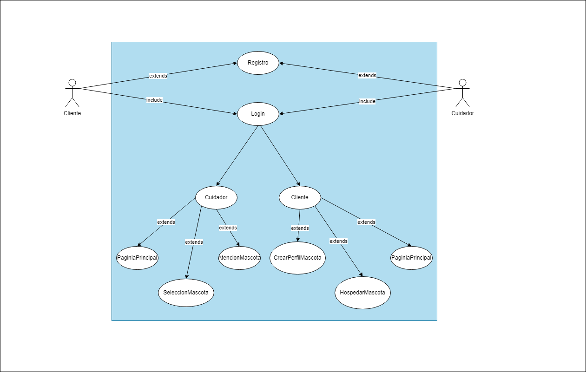

# AYD_P2_G4

## Análisis de Requerimientos para la Fase 1
1. Roles y Funcionalidades

    Cuidadores:
        Gestionar el cuidado de las mascotas.
        Realizar actividades diarias con las mascotas.
        Manejar un máximo de dos mascotas simultáneamente.
        Editar su perfil y datos.
    Usuarios (Dueños de Mascotas):
        Crear perfiles para sus mascotas.
        Solicitar hospedaje para sus mascotas.
        Ver el estado de sus mascotas hospedadas.
        Editar su perfil y datos.

2. Proceso de Registro

    Recopilación de datos personales y de contacto.
    Validación de correo electrónico y seguridad de contraseña.

3. Inicio de Sesión

    Envío de código a correo electrónico en el primer inicio de sesión.
    Manejo de errores en caso de contraseña o código incorrecto.

4. Funcionalidades Específicas de Cuidadores

    Selección y atención de mascotas.
    Visualización y edición de perfiles de mascotas.
    Gestión de estados de las mascotas (comiendo, paseando, etc.).

5. Funcionalidades Específicas de Usuarios

    Creación de perfiles de mascotas con detalles específicos.
    Funcionalidad para solicitar hospedaje de mascotas.

## Diseño y Modelado
### Casos de Uso a Alto Nivel

### 1. Registro de Usuario

| Nombre | Registro de Usuario |
| --- | --- |
| Tipo | Primario |
| Roles | Usuario, Cuidador |
| Descripción | Creación de cuentas de usuario y cuidador en la plataforma. |

### 2. Inicio de Sesión

| Nombre | Inicio de Sesión |
| --- | --- |
| Tipo | Primario |
| Roles | Usuario, Cuidador |
| Descripción | Acceso seguro a la plataforma para usuarios registrados. |

### 3. Creación de Perfil de Mascota

| Nombre | Creación de Perfil de Mascota |
| --- | --- |
| Tipo | Primario |
| Roles | Usuario |
| Descripción | Creación y gestión de perfiles para las mascotas de los usuarios. |

### 4. Selección de Mascota (Cuidador)

| Nombre | Selección de Mascota |
| --- | --- |
| Tipo | Primario |
| Roles | Cuidador |
| Descripción | Selección de mascotas para cuidar por parte del cuidador. |

### 5. Hospedaje de Mascota

| Nombre | Hospedaje de Mascota |
| --- | --- |
| Tipo | Primario |
| Roles | Usuario |
| Descripción | Funcionalidad para que los usuarios soliciten el hospedaje de sus mascotas. |

### Casos de Uso Expandidos

### 1. Registro de Usuario

| Nombre | Registro de Usuario |
| --- | --- |
| Tipo | Primario |
| Roles | Usuario, Cuidador |
| Descripción | Registro en la plataforma Huellita Feliz. |
| Flujo | 1. Ingresar datos personales y de contacto. 2. Elegir rol (usuario o cuidador). 3. Crear contraseña. 4. Confirmar registro. |
| Flujo alterno | 4. Mensaje de error si el correo ya está registrado. |

### 2. Inicio de Sesión

| Nombre | Inicio de Sesión |
| --- | --- |
| Tipo | Primario |
| Roles | Usuario, Cuidador |
| Descripción | Acceso a la plataforma con credenciales de usuario. |
| Flujo | 1. Ingresar correo y contraseña. 2. Validación de credenciales. 3. Acceso concedido. |
| Flujo alterno | 2. Mensaje de error si las credenciales son incorrectas. |

### 3. Creación de Perfil de Mascota

| Nombre | Creación de Perfil de Mascota |
| --- | --- |
| Tipo | Primario |
| Roles | Usuario |
| Descripción | Creación de perfiles para mascotas. |
| Flujo | 1. Ingresar detalles de la mascota. 2. Guardar perfil. |
| Flujo alterno | No aplica. |

### 4. Selección de Mascota (Cuidador)

| Nombre | Selección de Mascota |
| --- | --- |
| Tipo | Primario |
| Roles | Cuidador |
| Descripción | Selección de mascotas para cuidado. |
| Flujo | 1. Visualizar mascotas disponibles. 2. Elegir mascota. 3. Confirmar selección. |
| Flujo alterno | 3. Mensaje de error si ya se tienen 2 mascotas. |

### 5. Hospedaje de Mascota

| Nombre | Hospedaje de Mascota |
| --- | --- |
| Tipo | Primario |
| Roles | Usuario |
| Descripción | Reserva de hospedaje para mascotas. |
| Flujo | 1. Elegir mascota del perfil. 2. Seleccionar fechas de hospedaje. 3. Confirmar reserva. |
| Flujo alterno | No aplica. |

## Casos de uso para la fase 2

### 1. Publicar y Gestionar Reseñas

| Nombre | Publicar y Gestionar Reseñas |
| --- | --- |
| Tipo | Primario |
| Roles | Cliente, Cuidador |
| Descripción | Permite a los clientes y cuidadores publicar reseñas sobre los servicios y gestionarlas. |

### 2. Gestionar Productos en la Tienda

| Nombre | Gestionar Productos en la Tienda |
| --- | --- |
| Tipo | Primario |
| Roles | Cuidador (vendedor), Cliente (comprador) |
| Descripción | Los cuidadores pueden añadir, actualizar o eliminar productos de la tienda. Los clientes pueden ver los productos disponibles. |

### 3. Devolución de Mascota

| Nombre | Devolución de Mascota |
| --- | --- |
| Tipo | Primario |
| Roles | Cuidador |
| Descripción | Permite a los cuidadores devolver una mascota a su dueño y actualizar el estado del hospedaje. |

### 4. Recoger Mascota

| Nombre | Recoger Mascota |
| --- | --- |
| Tipo | Primario |
| Roles | Cliente |
| Descripción | Permite a los clientes marcar sus mascotas como recogidas después del hospedaje. |

### Casos de Uso Expandidos

### Publicar Reseña

| Nombre | Publicar Reseña |
| --- | --- |
| Tipo | Primario |
| Roles | Cliente, Cuidador |
| Descripción | Los usuarios pueden publicar reseñas sobre un servicio específico. Los cuidadores pueden responder o eliminar reseñas inapropiadas. |
| Flujo | 1. El usuario selecciona un servicio para revisar. 2. El usuario escribe y envía una reseña. |
| Flujo Alterno | Si el usuario intenta publicar contenido inapropiado, el sistema rechaza la reseña. |

### Añadir Producto a la Tienda

| Nombre | Añadir Producto a la Tienda |
| --- | --- |
| Tipo | Primario |
| Roles | Cuidador |
| Descripción | Los cuidadores pueden añadir productos a la tienda, incluyendo detalles como nombre, descripción, precio y cantidad. |
| Flujo | 1. El cuidador accede a la sección de gestión de la tienda. 2. El cuidador introduce la información del producto y lo publica. |
| Flujo Alterno | Si falta información del producto, el sistema solicita que se complete antes de la publicación. |

### Finalizar Hospedaje de Mascota

| Nombre | Finalizar Hospedaje de Mascota |
| --- | --- |
| Tipo | Primario |
| Roles | Cuidador |
| Descripción | El cuidador finaliza el hospedaje de una mascota, actualizando su estado en el sistema y notificando al dueño. |
| Flujo | 1. El cuidador selecciona la mascota a devolver. 2. El cuidador marca el hospedaje como finalizado. |
| Flujo Alterno | Si el hospedaje no puede finalizarse, el sistema muestra un mensaje de error. |

### Confirmar Recogida de Mascota

| Nombre | Confirmar Recogida de Mascota |
| --- | --- |
| Tipo | Primario |
| Roles | Cliente |
| Descripción | El cliente confirma la recogida de su mascota, cambiando su estado en el sistema. |
| Flujo | 1. El cliente selecciona la mascota a recoger. 2. El cliente confirma la recogida en el sistema. |
| Flujo Alterno | Si hay un problema con la recogida, el sistema muestra un mensaje de error. |

### Historias de Usuario para la Fase 1

### Historias de Usuario para Registro e Inicio de Sesión

1. **Como** un nuevo usuario, **quiero** poder registrarme en la plataforma, **para** acceder a los servicios de hospedaje y cuidado de mascotas.
2. **Como** un usuario registrado, **quiero** iniciar sesión con mis credenciales, **para** acceder a mi cuenta y ver o gestionar la información de mis mascotas.

### Historias de Usuario para Usuarios (Clientes)

1. **Como** dueño de una mascota, **quiero** crear perfiles para mis mascotas, **para** proporcionar información detallada que ayude a los cuidadores en su atención.
2. **Como** dueño de una mascota, **quiero** solicitar hospedaje para mis mascotas en la plataforma, **para** asegurarme de que estén bien cuidadas en mi ausencia.

### Historias de Usuario para Cuidadores

1. **Como** cuidador, **quiero** poder seleccionar mascotas para cuidar, **para** gestionar mi carga de trabajo y brindar atención adecuada.
2. **Como** cuidador, **quiero** ver y actualizar el estado de las mascotas que estoy cuidando, **para** informar a los dueños sobre las actividades y el bienestar de sus mascotas.


## Desarrollo
### Backend y Base de Datos
Herramientas
- Node js
- MySql

#### Base de datos

**Modelo Lógico**
1. Usuarios

    ID_Usuario (clave primaria)
    Nombre
    Apellido
    Telefono
    Email
    Contraseña
    Fecha_Nacimiento
    Rol (Cliente o Cuidador)

2. Mascotas

    ID_Mascota (clave primaria)
    Nombre
    Edad
    Especie
    Raza
    Comportamiento
    Contacto_Veterinario
    Comentarios_Extra
    ID_Usuario (clave foránea de Usuarios)

3. Hospedajes

    ID_Hospedaje (clave primaria)
    ID_Mascota (clave foránea de Mascotas)
    Fecha_Inicio
    Fecha_Fin
    Estado
    ID_Cuidador (clave foránea de Usuarios, referenciando a cuidadores)

4. Reseñas

    ID_Reseña (clave primaria)
    ID_Usuario (clave foránea de Usuarios)
    Comentario
    Calificación
    Fecha

5. Perfil del Cuidador (Opcional, dependiendo de los requisitos específicos)

    ID_Usuario (clave primaria y foránea de Usuarios)
    Experiencia
    Calificaciones

Relaciones

    Usuarios - Mascotas:
        Uno a muchos (un usuario puede tener varias mascotas).
    Usuarios - Reseñas:
        Uno a muchos (un usuario puede escribir varias reseñas).
    Mascotas - Hospedajes:
        Uno a muchos (una mascota puede tener varios hospedajes).
    Cuidadores (Usuarios) - Hospedajes:
        Uno a muchos (un cuidador puede tener asignados varios hospedajes).

**Modelo Físico**
Tabla: Usuarios

    ID_Usuario INT AUTO_INCREMENT PRIMARY KEY
    Nombre VARCHAR(50)
    Apellido VARCHAR(50)
    Telefono VARCHAR(15)
    Email VARCHAR(100) UNIQUE
    Contraseña VARCHAR(255)
    Fecha_Nacimiento DATE
    Rol ENUM('Cliente', 'Cuidador')

Tabla: Mascotas

    ID_Mascota INT AUTO_INCREMENT PRIMARY KEY
    Nombre VARCHAR(50)
    Edad INT
    Especie VARCHAR(50)
    Raza VARCHAR(50)
    Comportamiento TEXT
    Contacto_Veterinario VARCHAR(100)
    Comentarios_Extra TEXT
    ID_Usuario INT, FOREIGN KEY (ID_Usuario) REFERENCES Usuarios(ID_Usuario)

Tabla: Hospedajes

    ID_Hospedaje INT AUTO_INCREMENT PRIMARY KEY
    ID_Mascota INT, FOREIGN KEY (ID_Mascota) REFERENCES Mascotas(ID_Mascota)
    Fecha_Inicio DATE
    Fecha_Fin DATE
    Estado ENUM('Comiendo', 'Paseando', 'Bañado', 'Tomando la siesta', 'Jugando')
    ID_Cuidador INT, FOREIGN KEY (ID_Cuidador) REFERENCES Usuarios(ID_Usuario)

Tabla: Reseñas

    ID_Reseña INT AUTO_INCREMENT PRIMARY KEY
    ID_Usuario INT, FOREIGN KEY (ID_Usuario) REFERENCES Usuarios(ID_Usuario)
    Comentario TEXT
    Calificación INT
    Fecha TIMESTAMP DEFAULT CURRENT_TIMESTAMP

Tabla: Perfil del Cuidador (si es necesario)

    ID_Usuario INT PRIMARY KEY, FOREIGN KEY (ID_Usuario) REFERENCES Usuarios(ID_Usuario)
    Experiencia TEXT
    Calificaciones DECIMAL(3,2)

**Script SQL para la Creación de la Base de Datos**
```sql
-- Crear la base de datos
CREATE DATABASE IF NOT EXISTS huellita_feliz;
USE huellita_feliz;

-- Crear tabla de Usuarios
CREATE TABLE IF NOT EXISTS Usuarios (
    ID_Usuario INT AUTO_INCREMENT PRIMARY KEY,
    Nombre VARCHAR(50),
    Apellido VARCHAR(50),
    Telefono VARCHAR(15),
    Email VARCHAR(100) UNIQUE,
    Contraseña VARCHAR(255),
    Fecha_Nacimiento DATE,
    Rol ENUM('Cliente', 'Cuidador')
);

-- Crear tabla de Mascotas
CREATE TABLE IF NOT EXISTS Mascotas (
    ID_Mascota INT AUTO_INCREMENT PRIMARY KEY,
    Nombre VARCHAR(50),
    Edad INT,
    Especie VARCHAR(50),
    Raza VARCHAR(50),
    Comportamiento TEXT,
    Contacto_Veterinario VARCHAR(100),
    Comentarios_Extra TEXT,
    ID_Usuario INT,
    FOREIGN KEY (ID_Usuario) REFERENCES Usuarios(ID_Usuario)
);

-- Crear tabla de Hospedajes
CREATE TABLE IF NOT EXISTS Hospedajes (
    ID_Hospedaje INT AUTO_INCREMENT PRIMARY KEY,
    ID_Mascota INT,
    Fecha_Inicio DATE,
    Fecha_Fin DATE,
    Estado ENUM('Comiendo', 'Paseando', 'Bañado', 'Tomando la siesta', 'Jugando'),
    ID_Cuidador INT,
    FOREIGN KEY (ID_Mascota) REFERENCES Mascotas(ID_Mascota),
    FOREIGN KEY (ID_Cuidador) REFERENCES Usuarios(ID_Usuario)
);

-- Crear tabla de Reseñas
CREATE TABLE IF NOT EXISTS Reseñas (
    ID_Reseña INT AUTO_INCREMENT PRIMARY KEY,
    ID_Usuario INT,
    Comentario TEXT,
    Calificación INT,
    Fecha TIMESTAMP DEFAULT CURRENT_TIMESTAMP,
    FOREIGN KEY (ID_Usuario) REFERENCES Usuarios(ID_Usuario)
);

-- Crear tabla de Perfil del Cuidador (opcional)
CREATE TABLE IF NOT EXISTS Perfil_Cuidador (
    ID_Usuario INT PRIMARY KEY,
    Experiencia TEXT,
    Calificaciones DECIMAL(3,2),
    FOREIGN KEY (ID_Usuario) REFERENCES Usuarios(ID_Usuario)
);
```

**Diagrama Entidad Relacion**
Insertar imagen


**Diagrama Casos de Uso**
